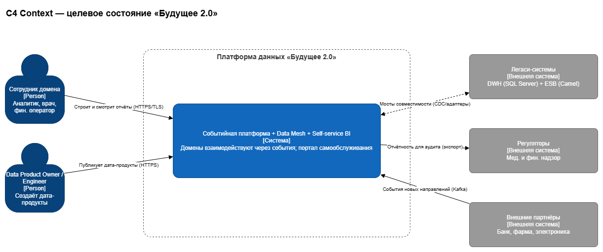
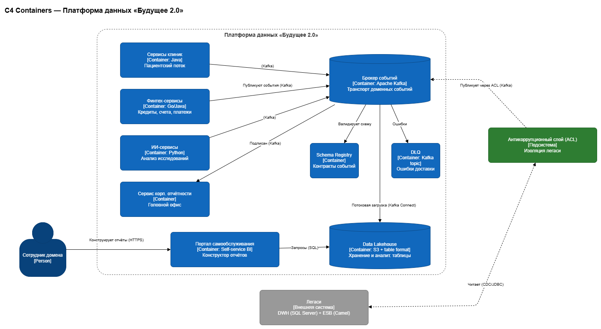
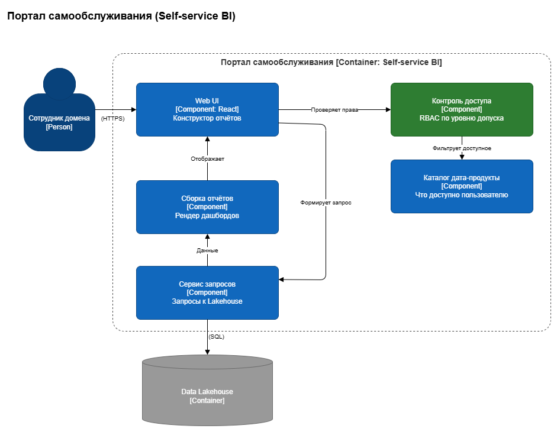
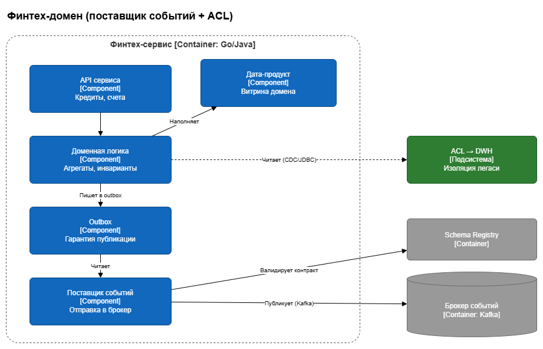

# Целевая архитектура 

Целевая архитектура «Будущего 2.0» на горизонт 3 года и анализ рисков трансформации.

## Состав

```
Task3Advanced/
├── c4/
│   ├── c4-context.drawio      # Уровень 1 — System Context
│   ├── c4-containers.drawio   # Уровень 2 — Containers (обязательный)
│   └── c4-components.drawio   # Уровень 3 — Components (2 страницы: BI и финтех)
├── risks.md                   # карта рисков (категории, вероятность, влияние)
├── risk-management.md         # план управления (техн. / упр. меры)
└── README.md
```


### Превью













## Целевая архитектура

Слабосвязанная **событийная платформа** + **Data Mesh** + **Self-service BI**: домены обмениваются событиями через **Kafka** + **Schema Registry** + **DLQ**; данные — в **Data Lakehouse**, потребление — через портал самообслуживания с RBAC; легаси (**DWH**, **Camel**) изолировано через **ACL** и выводится по этапам; медкарты/исследования в аналитику не попадают. Новые домены (фарма, электроника) подключаются как поставщики событий без изменения ядра.

## Куда переезжает логика ESB 

Функции старой шины распределяются по компонентам EDA

| Функция ESB  | В целевой архитектуре |
|---|---|
| Маршрутизация | Pub/sub через топики Kafka + подписки консьюмеров |
| Трансформации форматов | На стороне доменных сервисов; схемы - в Schema Registry |
| ФЛК / валидация | Schema Registry (контракт событий), невалидные сообщения -> DLQ |
| Ретраи / гарантия доставки | Transactional Outbox, ретраи, DLQ |
| Оркестрация | Хореография через события; при необходимости - Saga внутри домена |
| Интеграционная / бизнес-логика | Возвращается во владение доменов (Data Mesh); к легаси - через ACL на время миграции |

