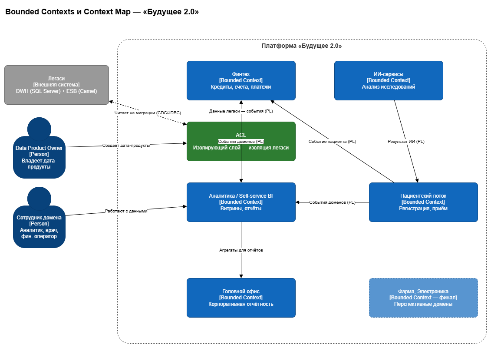
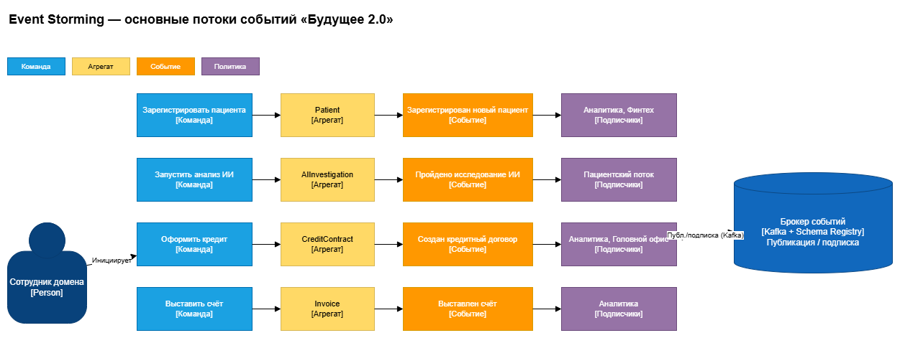

# Моделирование домена и интеграций (DDD + Event Storming)

Разделение системы «Будущее 2.0» на домены (DDD), целевая событийная архитектура и обоснование перехода с Camel/DWH на события.

## Состав

```
Task4Advanced/
├── bounded-contexts.drawio   # домены + context map (ACL, Published Language)
├── event-storming.drawio     # команды → агрегаты → события → подписчики
├── aggregates.md             # агрегаты: границы, инварианты, ключи
├── events.md                 # каталог событий: источник, подписчики, контракт
├── justification.md          # обоснование event-driven vs Camel/DWH
└── README.md
```

Диаграммы — в формате **draw.io** (`.drawio`), открываются на [app.diagrams.net](https://app.diagrams.net). Рядом лежит готовый `.png`-рендер каждой.

### Превью

**Bounded contexts (context map):**



**Event Storming:**



## Домены (bounded contexts)

| Домен | Ответственность | Ключевой агрегат |
|---|---|---|
| Финтех | Кредиты, счета, платежи | CreditContract, Invoice |
| Пациентский поток | Регистрация и приём пациентов | Patient |
| ИИ-сервисы | Анализ исследований | AIInvestigation |
| Аналитика / Self-service BI | Витрины и отчёты | — (потребитель) |
| Головной офис | Корпоративная отчётность | — (потребитель) |
| Фарма, Электроника | Перспективные домены | — |

Связи между доменами — только через **события** (Published Language); легаси изолировано через **ACL**. Медкарты/исследования в аналитику не передаются.

## Согласованность
- Домены соответствуют C4 и рискам в **Task3**.
- События и Schema Registry/DLQ используются в техрадаре и роадмапе **Task5**.
