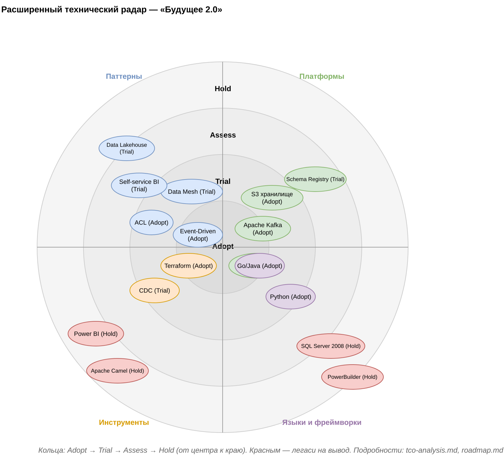
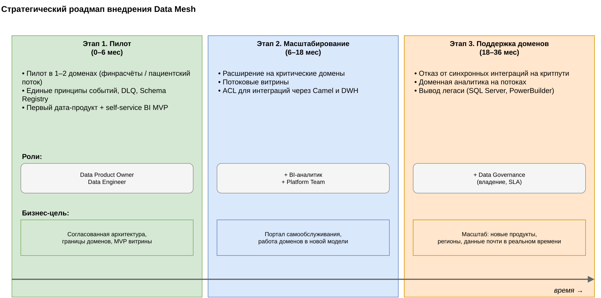

# Task5Advanced — Технологический стек, TCO и роадмап Data Mesh

Целевой техстек, экономическое обоснование и план внедрения Data Mesh для «Будущего 2.0».

## Состав

```
Task5Advanced/
├── tech-radar.drawio   # расширенный техрадар (технологии + паттерны, Adopt/Trial/Assess/Hold)
├── tco-analysis.md     # TCO текущая vs целевая, 3 года
├── roadmap.drawio      # роадмап Data Mesh: этапы, роли, бизнес-цели
└── README.md
```

Диаграммы — в формате **draw.io** (`.drawio`); рядом лежит `.png`-рендер.

## Технический радар

Включает **технологии и архитектурные паттерны** со статусом Adopt/Trial/Assess/Hold:
- **Паттерны:** Event-Driven (Adopt), Data Mesh (Trial), Self-service BI (Trial), ACL (Adopt), Data Lakehouse (Trial).
- **Платформы:** Apache Kafka (Adopt), S3-хранилище (Adopt), Schema Registry (Trial), облако (Adopt).
- **Инструменты:** Terraform (Adopt), CDC (Trial); легаси Power BI, Apache Camel — **Hold**.
- **Языки:** Go/Java, Python (Adopt); SQL Server 2008, PowerBuilder — **Hold**.

Легаси помечено **Hold** — выводится по этапам роадмапа.



## TCO

Сравнение текущей и целевой архитектуры на 3 года по статьям: инфраструктура, лицензии, сопровождение, время аналитиков, миграция, обучение/ИБ — см. [tco-analysis.md](./tco-analysis.md). Итог: целевая дешевле на ~17% за 3 года, главный эффект — ускорение отчётности.

## Роадмап Data Mesh

Три этапа (пилот 0–6 / масштабирование 6–18 / поддержка 18–36 мес) с ролями (Data Product Owner, Data Engineer, BI-аналитик, + Platform/Governance) и привязкой к бизнес-целям.



## Согласованность
- Технологии и паттерны соответствуют C4/рискам **Task3** и доменам **Task4**.
- Этапы роадмапа совпадают с этапами трансформации из кейса.
